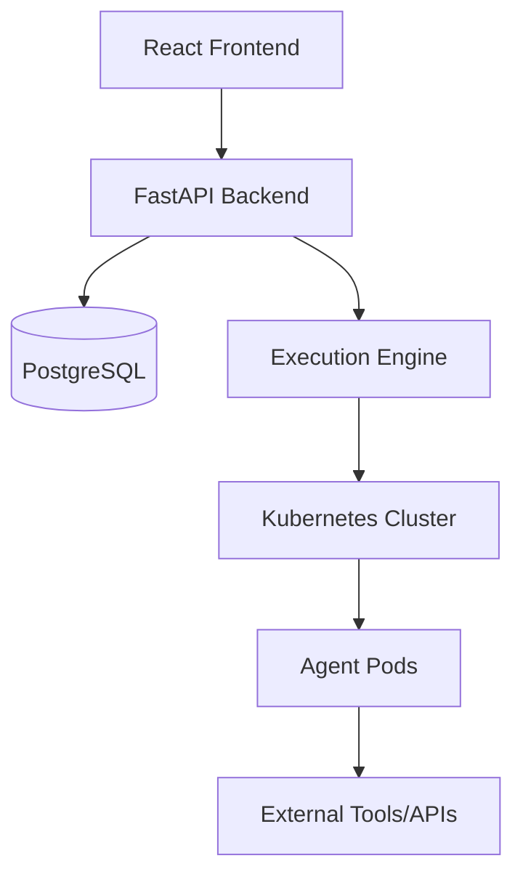

# 🤖 AgentFlow - Visual Multi-Agent Workflow Designer

> **Transform complex AI workflows into simple drag-and-drop experiences**

[](https://opensource.org/licenses/MIT)
[](https://github.com/yourusername/agentflow/actions)
[](https://www.typescriptlang.org/)
[](https://reactjs.org/)
[](https://fastapi.tiangolo.com/)
[](https://www.docker.com/)
[](https://kubernetes.io/)

## 🎯 Vision

AgentFlow democratizes AI workflow creation by providing a visual, drag-and-drop interface for designing, deploying, and monitoring multi-agent systems. Think "GitHub Actions meets LangGraph" with enterprise-grade reliability.

## ✨ Key Features

### 🖱️ Visual Workflow Designer
- **Drag & Drop Interface**: Intuitive node-based workflow creation
- **Real-time Preview**: Live validation and execution simulation  
- **Template Library**: Pre-built agent workflows for common use cases
- **Collaborative Editing**: Multi-user workflow design with conflict resolution

### 🤖 Agent Marketplace
- **Agent Registry**: Curated collection of AI agents and tools
- **Custom Agents**: Import your own agents with standardized interfaces
- **Version Management**: Track and rollback agent versions
- **Performance Analytics**: Monitor agent effectiveness and costs

### 🚀 Enterprise Ready
- **Scalable Execution**: Kubernetes-native workflow execution
- **Security First**: Role-based access control and audit logging
- **Multi-tenancy**: Isolated workspaces for teams and organizations
- **Monitoring & Alerting**: Real-time workflow observability

## 🏗️ Architecture



## 🚀 Quick Start

### Prerequisites
- Node.js 18+ and npm
- Python 3.11+
- Docker and Docker Compose
- Kubernetes cluster (for production)

### Development Setup

1. **Clone the repository**
   ```bash
   git clone https://github.com/yourusername/agentflow.git
   cd agentflow
   ```

2. **Quick Setup (Recommended)**
   ```bash
   chmod +x setup-dev.sh
   ./setup-dev.sh
   ```

3. **Manual Setup**
   ```bash
   # Copy environment file
   cp .env.example .env
   # Edit .env with your configuration
   
   # Start services
   docker-compose up -d
   
   # Install frontend dependencies
   cd frontend && npm install
   
   # Install backend dependencies
   cd backend && pip install -r requirements.txt
   ```

5. **Access the Application**
   - Frontend: http://localhost:5173
   - Backend API: http://localhost:8000
   - API Docs: http://localhost:8000/docs

## 📚 Documentation

- [🏛️ Architecture Guide](./docs/ARCHITECTURE.md)
- [🔌 API Reference](./docs/API.md)
- [🚢 Deployment Guide](./docs/DEPLOYMENT.md)
- [🤖 Agent Development](./docs/AGENT_RULES.md)
- [🐛 Debugging Guide](./docs/DEBUGGING.md)

## 🛠️ Technology Stack

### Frontend
- **React 18** with TypeScript
- **Vite** for build tooling
- **Tailwind CSS** for styling
- **React Flow** for workflow visualization
- **Zustand** for state management
- **React Query** for data fetching

### Backend
- **FastAPI** with Python 3.11+
- **PostgreSQL** with SQLAlchemy
- **Redis** for caching and queues
- **Celery** for background tasks
- **Docker** for containerization

### Infrastructure
- **Kubernetes** for container orchestration
- **Prometheus** for metrics
- **Grafana** for monitoring dashboards
- **Traefik** for ingress and load balancing

## 🎨 Design System

### Colors
- **Primary**: Electric Blue (#007AFF)
- **Secondary**: Neon Green (#00FF87)
- **Accent**: Deep Purple (#6366F1)

### Typography
- **Primary Font**: Inter
- **Code Font**: JetBrains Mono

## 🤝 Contributing

We welcome contributions! Please read our [Contributing Guide](./CONTRIBUTING.md) for details.

### Development Workflow
1. Fork the repository
2. Create a feature branch (`git checkout -b feature/amazing-feature`)
3. Commit your changes (`git commit -m 'Add amazing feature'`)
4. Push to the branch (`git push origin feature/amazing-feature`)
5. Open a Pull Request

## 📄 License

This project is licensed under the MIT License - see the [LICENSE](./LICENSE) file for details.

## 🆘 Support

- 📖 [Documentation](./docs/)
- 💬 [Discussions](https://github.com/your-org/agentflow/discussions)
- 🐛 [Issues](https://github.com/your-org/agentflow/issues)
- 📧 Email: support@agentflow.dev

## 🗺️ Roadmap

- [x] **Phase 1**: Visual workflow designer
- [x] **Phase 2**: Agent marketplace and registry
- [ ] **Phase 3**: Advanced monitoring and analytics
- [ ] **Phase 4**: Multi-cloud deployment
- [ ] **Phase 5**: AI-powered workflow optimization

---

**Built with ❤️ by the AgentFlow Team**