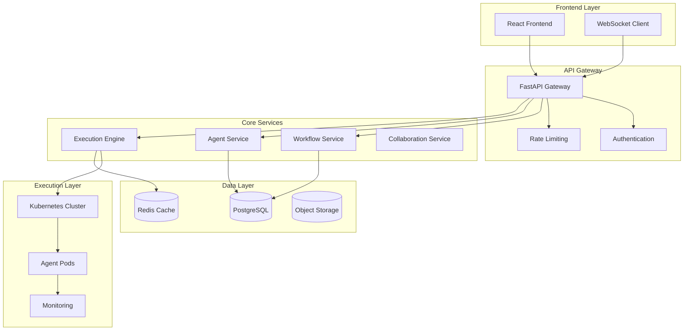

# 🏗️ Architecture Overview

## System Design Philosophy

AgentFlow follows a **microservices-inspired architecture** with clear separation between the visual interface, workflow orchestration, and agent execution layers. The system prioritizes scalability, maintainability, and developer experience.

## High-Level Architecture



## Component Architecture

### 1. Frontend Architecture (React + TypeScript)

**Technology Stack:**
- React 18 with TypeScript for type safety
- Vite for fast development and building
- Zustand for lightweight state management
- React Flow for visual workflow design
- Tailwind CSS for consistent styling

**Key Components:**
```
src/
├── components/
│   ├── workflow/          # Drag-and-drop workflow designer
│   ├── agents/           # Agent marketplace and management
│   ├── monitoring/       # Real-time execution monitoring
│   └── ui/              # Reusable UI primitives
├── stores/              # Global state management
├── hooks/               # Custom React hooks
└── pages/              # Route components
```

**Design Patterns:**
- **Component Composition**: Modular, reusable components
- **Custom Hooks**: Encapsulated business logic
- **State Management**: Centralized stores with Zustand
- **Real-time Updates**: WebSocket integration for live collaboration

### 2. Backend Architecture (FastAPI + Python)

**Technology Stack:**
- FastAPI for high-performance async API
- SQLAlchemy with async support for database ORM
- PostgreSQL for relational data storage
- Redis for caching and pub/sub messaging
- Celery for background task processing

**Service Architecture:**
```
backend/
├── app/
│   ├── api/             # REST API endpoints
│   ├── core/            # Core services and utilities
│   ├── models/          # Database models
│   ├── services/        # Business logic services
│   ├── agents/          # Agent execution framework
│   └── utils/           # Helper utilities
```

**Key Services:**
- **Workflow Service**: CRUD operations for workflows
- **Agent Service**: Agent registry and management
- **Execution Service**: Workflow execution orchestration
- **Collaboration Service**: Real-time editing and updates
- **Monitoring Service**: Performance and health monitoring

### 3. Database Architecture

**PostgreSQL Schema Design:**
```sql
-- Core entities
workflows (id, name, description, definition, created_at, updated_at)
agents (id, name, type, config, version, created_at)
executions (id, workflow_id, status, inputs, outputs, started_at, completed_at)
users (id, email, name, created_at, updated_at)

-- Relationships
workflow_agents (workflow_id, agent_id, position, config)
execution_logs (execution_id, timestamp, level, message, metadata)
collaborations (workflow_id, user_id, last_seen, cursor_position)
```

**Data Flow Patterns:**
- **CQRS**: Separate read/write operations for performance
- **Event Sourcing**: Audit trail for workflow changes
- **Optimistic Locking**: Conflict resolution for collaborative editing

### 4. Execution Engine Architecture

**Container Orchestration (Kubernetes):**
```yaml
# Agent execution pods
apiVersion: v1
kind: Pod
spec:
  containers:
  - name: agent-executor
    image: agentflow/agent-runtime
    resources:
      requests:
        memory: "256Mi"
        cpu: "200m"
      limits:
        memory: "512Mi"
        cpu: "500m"
```

**Execution Flow:**
1. **Workflow Validation**: Parse and validate workflow definition
2. **Resource Allocation**: Create execution pods in Kubernetes
3. **Agent Deployment**: Deploy required agents to allocated pods
4. **Execution Monitoring**: Real-time status updates via WebSocket
5. **Result Collection**: Aggregate outputs and cleanup resources

## Security Architecture

### Authentication & Authorization
- **JWT Tokens**: Stateless authentication with refresh mechanism
- **RBAC**: Role-based access control for team management
- **API Keys**: Service-to-service authentication
- **Rate Limiting**: Per-user and per-endpoint request throttling

### Data Security
- **Encryption at Rest**: AES-256 encryption for sensitive data
- **Encryption in Transit**: TLS 1.3 for all communications
- **Secret Management**: Kubernetes secrets for API keys and credentials
- **Audit Logging**: Comprehensive audit trail for compliance

## Scalability Considerations

### Horizontal Scaling
- **Stateless Services**: All services designed for horizontal scaling
- **Load Balancing**: Round-robin load balancing with health checks
- **Database Sharding**: Partition data by tenant for large deployments
- **CDN Integration**: Static asset delivery via CloudFront/Cloudflare

### Performance Optimization
- **Connection Pooling**: Optimized database connection management
- **Redis Caching**: Multi-layer caching strategy
- **Async Processing**: Non-blocking I/O for high throughput
- **Resource Limits**: Container resource limits for predictable performance

## Monitoring & Observability

### Metrics Collection
- **Prometheus**: Application and infrastructure metrics
- **Grafana**: Real-time dashboards and alerting
- **Custom Metrics**: Business-specific KPIs and performance indicators

### Logging & Tracing
- **Structured Logging**: JSON-formatted logs with correlation IDs
- **Distributed Tracing**: Request tracing across service boundaries
- **Error Tracking**: Centralized error collection and alerting

### Health Checks
- **Kubernetes Probes**: Liveness and readiness checks
- **Service Health**: Internal health check endpoints
- **Dependency Monitoring**: External service dependency tracking

## Development Workflow

### Local Development
```bash
# Start development environment
docker-compose up -d

# Frontend development
cd frontend && npm run dev

# Backend development
cd backend && python main.py
```

### Deployment Pipeline
1. **Code Quality**: ESLint, Prettier, Black, mypy
2. **Testing**: Unit tests, integration tests, E2E tests
3. **Build**: Docker image builds with multi-stage optimization
4. **Deploy**: Kubernetes rolling deployments
5. **Monitor**: Post-deployment health checks and monitoring

## Technology Decisions & Rationale

### Frontend Technology Choices

**React Flow**: Chosen for mature drag-and-drop workflow capabilities
- ✅ Rich ecosystem of workflow nodes and edges
- ✅ Built-in pan, zoom, and selection handling
- ✅ Extensible architecture for custom nodes
- ❌ Larger bundle size compared to alternatives

**Zustand vs Redux**: Lightweight state management
- ✅ Minimal boilerplate and learning curve
- ✅ TypeScript-first design
- ✅ Excellent developer experience
- ❌ Smaller community compared to Redux

### Backend Technology Choices

**FastAPI vs Flask/Django**: High-performance async API
- ✅ Automatic API documentation generation
- ✅ Built-in validation with Pydantic
- ✅ Async/await support for high throughput
- ❌ Newer ecosystem with fewer plugins

**PostgreSQL vs MongoDB**: Relational data integrity
- ✅ ACID compliance for workflow consistency
- ✅ Rich query capabilities and indexing
- ✅ JSON support for flexible schemas
- ❌ More complex scaling compared to NoSQL

### Infrastructure Choices

**Kubernetes vs Docker Swarm**: Container orchestration
- ✅ Industry standard with rich ecosystem
- ✅ Advanced scheduling and resource management
- ✅ Horizontal pod autoscaling
- ❌ Higher complexity for small deployments

## Future Architecture Considerations

### Planned Enhancements
- **Multi-tenancy**: Namespace isolation for enterprise customers
- **Edge Computing**: Agent execution at edge locations
- **ML Pipeline Integration**: Native MLOps workflow support
- **Event-driven Architecture**: Transition to event sourcing patterns

### Scalability Roadmap
- **Microservices**: Further decomposition of monolithic services
- **Service Mesh**: Istio integration for advanced traffic management
- **Multi-cloud**: Support for AWS, GCP, and Azure deployments
- **Global Distribution**: Multi-region deployment capabilities